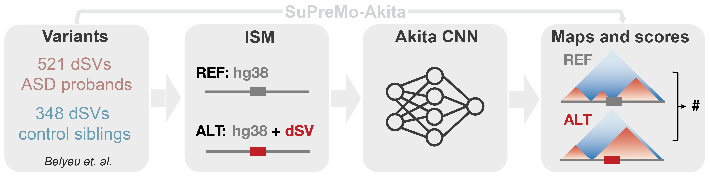

# De novo structural variants in autism spectrum disorder disrupt distal regulatory interactions of neuronal genes



Three-dimensional genome organization plays a critical role in gene regulation, and disruptions can lead to developmental disorders by altering the contact between genes and their distal regulatory elements. Structural variants (SVs) can disturb local genome organization, such as the merging of topologically associating domains upon boundary deletion. Testing large numbers of SVs experimentally for their effects on chromatin structure and gene expression is time and cost prohibitive. To address this, we propose a computational approach to predict SV impacts on genome folding, which can help prioritize causal hypotheses for functional testing. We developed a weighted scoring method that measures chromatin contact changes specifically affecting regions of interest, such as regulatory elements or promoters, and implemented it in the SuPreMo-Akita software (Gjoni and Pollard 2024). With this tool, we ranked hundreds of de novo SVs (dnSVs) from autism spectrum disorder (ASD) individuals and their unaffected siblings based on predicted disruptions to nearby neuronal regulatory interactions. This revealed that putative cisregulatory element interactions (CREints) are more disrupted by dnSVs from ASD probands versus unaffected siblings. We prioritized candidate variants that disrupt ASD CREints and validated our top-ranked locus using isogenic excitatory neurons with and without the dnSV, confirming accurate predictions of disrupted chromatin contacts. This study establishes disrupted genome folding as a potential genetic mechanism in ASD and provides a general strategy for prioritizing variants predicted to disrupt regulatory interactions across tissues.

[Preprint on bioRxiv](https://www.biorxiv.org/content/10.1101/2024.11.06.621353v1)

***

In this repo:

1. [Simons Simplex Collection dnSVs](https://github.com/ketringjoni/ASD_akita_project/tree/main?tab=readme-ov-file#1-simons-simplex-collection-dnSVs)
2. [Scoring SSC dnSVs with SuPreMo-Akita](https://github.com/ketringjoni/ASD_akita_project/tree/main?tab=readme-ov-file#2-scoring-ssc-dnsvs-with-SuPreMo-Akita)
3. [Scoring SSC dnSVs with CREint weights](https://github.com/ketringjoni/ASD_akita_project/tree/main?tab=readme-ov-file#3-scoring-ssc-dnsvs-with-creint-weights)
4. [Filtering SSC dnSVs using selection criteria](https://github.com/ketringjoni/ASD_akita_project/tree/main?tab=readme-ov-file#4-filtering-ssc-dnsvs-using-selection-criteria)
5. [HiC data analysis](https://github.com/ketringjoni/ASD_akita_project/tree/main?tab=readme-ov-file#5-hic-data-analysis)
6. [RNAseq data analysis](https://github.com/ketringjoni/ASD_akita_project/tree/main?tab=readme-ov-file#6-rnaseq-data-analysis)


## 1. Simons Simplex Collection dnSVs

De novo structural variants used in this study are from Simons Simplex Collection (SSC), as a part of Simons Foundation Autism Research Initiative (SFARI). Belyeu et al 2021 called dnSVs in hg38 using alignment-based, short-read WGS, and we pulled them from their Supplementary Table 1 into [data/SFARI_SSC_dnSVs.csv](https://github.com/ketringjoni/ASD_akita_project/blob/main/data/SFARI_SSC_dnSVs.csv).


## 2. Scoring SSC dnSVs with SuPreMo-Akita

We installed [SuPreMo-Akita](https://github.com/ketringjoni/SuPreMo?tab=readme-ov-file#install-supremo-or-supremo-akita) and cloned the SuPreMo repo into this repo. 

We scored SSC dnSVs: 
```
python SuPreMo/scripts/SuPreMo.py variant_scoring/supremo-akita_input/dnSVs_for_SuPreMo.txt \
--get_Akita_scores \
--dir variant_scoring/supremo-akita_output \
--file dnSV \
--fa SuPreMo/data/hg38.fa
```
Our steps to process the input and output files are in [variant_scoring/scoring_dnSVs.ipynb](https://github.com/ketringjoni/ASD_akita_project/blob/main/variant_scoring/scoring_dnSVs.ipynb#Scoring-dnSVs-using-SuPreMo-Akita).


## 3. Scoring SSC dnSVs with CREint weights

CREints were processed from [Song et. al. 2020](https://pubmed.ncbi.nlm.nih.gov/33057195/) excitatory neuron H3K4me3 PLACseq data, pulled from [NeMO](https://assets.nemoarchive.org/dat-uioqy8b) into [data/eN.MAPS.peaks.txt](https://github.com/ketringjoni/ASD_akita_project/blob/main/data/eN.MAPS.peaks.txt).

We scored SSC dnSVs near CREints with weighted scoring:
```
python SuPreMo/scripts/SuPreMo.py variant_scoring/supremo-akita_input_weighted/EP_for_SuPreMo.txt
--get_Akita_scores
--shifts_file variant_scoring/supremo-akita_input_weighted/EP_for_SuPreMo_shifts.txt
--roi variant_scoring/supremo-akita_input_weighted/EP_for_SuPreMo_weights.txt
--roi_scales 10 1000000
--dir variant_scoring/supremo-akita_output_weighted
--file EP
--fa SuPreMo/data/hg38.fa
```
Our steps to process the input and output files are in [variant_scoring/scoring_dnSVs.ipynb](https://github.com/ketringjoni/ASD_akita_project/blob/main/variant_scoring/scoring_dnSVs.ipynb#Scoring-dnSVs-near-CREints-using-SuPreMo-Akita-with-weighted-scoring).


## 4. Filtering SSC dnSVs using selection criteria

We defined a set of criteria to prioritize variants that are likely to be causal and can feasibly be tested in excitatory neuronal cells. The criteria and the variants that pass them (data for Figure S3A-B) are in [variant_prioritization/prioritizing_dnSVs.ipynb](https://github.com/ketringjoni/ASD_akita_project/blob/main/variant_prioritization/prioritizing_dnSVs.ipynb).


## 5. HiC data analysis

To process HiC fastq files into mcool files, we use the [4DN pipeline](https://data.4dnucleome.org/resources/data-analysis/hi_c-processing-pipeline). The code in [HiCanalyses/hic_analysis.sh](https://github.com/ketringjoni/ASD_akita_project/HiCanalyses/hic_analysis.sh) has beed adapted from the [4DN HiC Docker GitHub repo](https://github.com/4dn-dcic/docker-4dn-hic/tree/master). We used pacakge versions shown in [HiCanalyses/hic_analyses.yml](https://github.com/ketringjoni/ASD_akita_project/HiCanalyses/hic_analysis.sh) and ran:

```
hic_analyses.sh <nthreads>, <genome_index>, <chrom_sizes>, <fastq1_rep1>, <fastq2_rep1>, <fastq1_rep2>, <fastq2_rep2>, <prefix_rep1>, <prefix_rep2>, <prefix>, <outdir>, <hic_analysis_path>
```

Raw and analyzed HiC data can be found in GEO (accession number GSE281283).


## 6. RNAseq data analysis
*TBD*

Raw and analyzed RNAseq data can be found in GEO (accession number GSE281327).


***
*For any questions and/or feedback, please reach out to katie.gjoni at ucsf dot edu*

